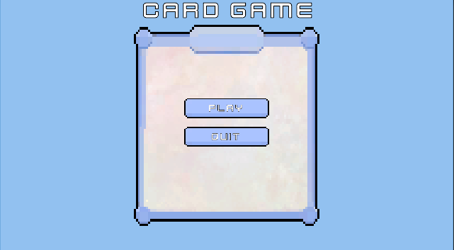
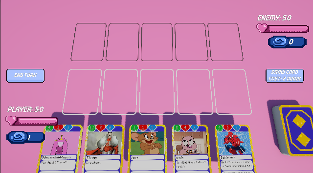

# 🃏 Card Game – Unity-Based Card Game Project

A card game developed using **Unity** and **C#** as part of a university course project. The game incorporates custom mechanics and interactive gameplay elements.

---

## 🎮 Features

- 🔄 Turn-based gameplay mechanics
- 🧠 Basic AI for single-player mode
- 🎨 Custom-designed UI and animations
- 📱 Responsive design suitable for various screen sizes

---

## 🛠 Technologies Used

- Unity 6
- C#
- Git & GitHub
- Visual Studio

---

## 📸 Screenshots


*Main menu interface of the game.*


*In-game screenshot showcasing the card layout and player interactions.*

---

## 🚀 Getting Started

1. Clone the repository:
   ```bash
   git clone https://github.com/zzynpkrdgg/cardGame.git
